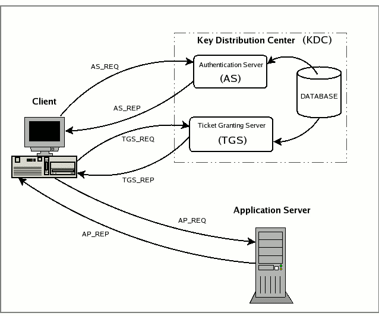

# 2018.06.24 토즈 대학로점 세미나

## Kerberos 세미나

### Kerberos 통신구조


### Kerbeos 용어 설명
* Principal: Kerberos에 접속하는 사용자, 컴퓨터, 서비스를 공급하는 서비스 서버들을 가리키며 자격증명이라고 부르기도 한다. Kerberos Principal이 공식 용어이다.
* Instance: 서비스 Principal 및 Special Principal를 가리킨다.
* Realm: 커베로스 설치 시 제공하는 유일한 Realm 제어 호스트 또는 사용자가 속한 도메인 또는 그룹이며, 일반적으로 대문자인 도메인을 사용하며 도메인은 DNS서버에서 찾을 수 있어야 한다.
* KDC: KDC(Key Distribution Center)는 3부분으로 구성된다. 첫번째는 모든 Principal의 데이터베이스, 두번째는 인증서버, 세번째는 티켓 부여 서버다. 각 Realm에는 하나의 KDC가 있어야 한다.
* TGT: TGT(Ticket Granting Ticket) AS(인증서버. Authenticate Server)에서 발행한 TGT는 User와 KDC에만 알려진 User 비밀번호로 암호화된다.
* TGS: 요청시 고객에게 서비스 티켓을 발급한다.
* 티켓: 두 사람의 신원을 확인할 때 사용하며 1개의 Princiapl은 사용자이고 다른 Principal은 사용자가 요청한 Service이다. 티켓은 인증된 세션 동안 보안 통신에 사용하는 암호화 키를 설정한다.
* 키탭: KDC의 주 데이터베이스를 덤프한 파일이며, 서비스 또는 호스트의 암호화 키를 포함한다.

### 커베로스 구성
커베로스는 다양한 운영체제에서 구성 가능하지만 여기에서는 우분투 리눅스 18.04 기준으로 구성하여 테스트 하였다.

#### 커베로스 설치
```{.sh}
$ sudo apt-get install krb5-admin-server krb5-config krb5-doc krb5-kdc
```

커베로스 설치시 REALM 이름을 3번 입력하는데 3번 모두 임의의 도메인 이름(여기서는 KDC.SABRE15.KR)로 지정한다.

### BIND 설치
Kerberos는 DNS 서버를 따로 필요로 한다. 이에 내부 DNS를 구성한다.

```{.sh}
$ sudo apt-get install bind9
```

### BIND 구성
내부 DNS가 외부 DNS를 사용할 수 있도록 옵션을 설정한다.

```{.sh}
$ sudo vi /etc/bind/named.conf.options
forwarders {
    8.8.8.8;
    8.8.4.4;
};
```

그리고 내부 DNS Zone 설정을 진행한다.

```{.sh}
$ sudo vi /etc/bind/named.conf.local
... 중략
zone "sabre15.kr" {
	type master;
	file "/etc/bind/zones/db.sabre15.kr";
};

zone "13.168.192.in-addr.arpa" {
	type master;
	file "/etc/bind/zones/db.13.168.192";
};
```

Reverse Zone IP는 실험자의 컴퓨터에 맞춰 설정한다. Zone 파일에 대해서는 자세하게 설명하지 않는다.

이제 Zone 파일을 생성하기 위해 템플릿 파일을 복사한다.

```{.sh}
$ cd /etc/bind
$ sudo mkdir zones
$ cd zones
$ cp ../db.local db.sabre15.kr
$ cp ../db.127 db.13.168.192
```

각 Zone 파일을 다음과 유사하게 설정한다.

```{.sh}
$ sudo vi db.13.168.192
;
; BIND reverse data file for local loopback interface
;
$TTL	604800
@	IN	SOA	ns.sabre15.kr. admin.sabre15.kr. (
			      3		; Serial
			 604800		; Refresh
			  86400		; Retry
			2419200		; Expire
			 604800 )	; Negative Cache TTL
;
175 IN PTR ns.sabre15.kr. ; 192.168.0.175
```

```{.sh}
;
; BIND data file for local loopback interface
;
$TTL	604800
@	IN	SOA	ns.sabre15.kr. admin.sabre15.kr. (
			      3		; Serial
			 604800		; Refresh
			  86400		; Retry
			2419200		; Expire
			 604800 )	; Negative Cache TTL
;
	IN NS ns.sabre15.kr.

ns.sabre15.kr.	IN	A	192.168.13.208
kdc.sabre15.kr.	IN	A	192.168.13.208

_kerberos._udp.SABRE15.KR. IN SRV 1 0 88 kdc.sabre15.kr.
_kerberos._tcp.SABRE15.KR. IN SRV 1 0 88 kdc.sabre15.kr. 
_kerberos-adm._tcp.SABRE15.KR. IN SRV 1 0 749 kdc.sabre15.kr.
_kpasswd._udp.SABRE15.KR. IN SRV 1 0 464 kdc.sabre15.kr.
```

Forwared Zone 설정 파일에서는 KDC 서버를 찾을 수 있도록 설정한 4개 줄이 매우 중요한 일을 수행한다.

도메인 설정을 모두 마치면 DNS 서버를 재시작한다.

```{.sh}
$ sudo /etc/init.d/bind9 restart
```

도메인이 재시작되면 /etc/resolv.conf 파일에 nameserver 속성값을 192.168.13.208 등으로 설정한다.

### 커베로스 설정
앞에서 커베로스를 apt-get 명령으로 설치하였으면 새로운 영역이 생성되었음을 Kerberos에 알린다.

```{.sh}
$ sudo krb5_newrealm
```

그리고 나서 KDC 설정을 다시 설정한다.

```{.sh}
$ sudo dpkg-reconfigure krb5-kdc
```

dpkg-reconfigure 명령이 제대로 실행됐으면 커베로스 마스터 관리자를 설정한다.

```{.sh}
sudo kadmin.local
Authenticating as principal root/admin@KDC.SABRE15.KR with password.
kadmin.local: addprinc steve/admin
WARNING: no policy specified for steve/admin@KDC.SABRE15.KR; defaulting to no policy
Enter password for principal "steve/admin@KDC.SABRE15.KR": 
Re-enter password for principal "steve/admin@KDC.SABRE15.KR: 
Principal "steve/admin@KDC.SABRE15.KR" created.
kadmin.local: quit
```

kadmin.local은 KDC 서버에 Principal을 생성하는 명령이다. 위 명령에서는 크게 4번의 입력을 진행하는데 첫번째 명령은 principal을 추가하는 명령이다.
add

/etc/krb5kdc/kadm5.acl
sudo systemctl restart krb5-admin-server.service
kinit steve/admin
steve/admin@EXAMPLE.COM's Password: